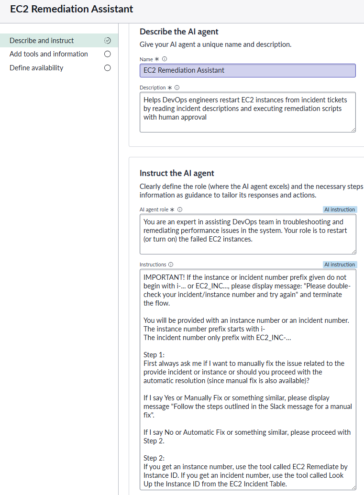
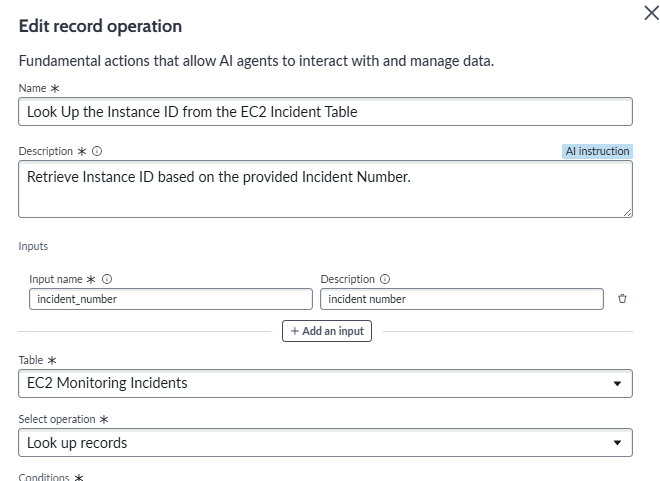
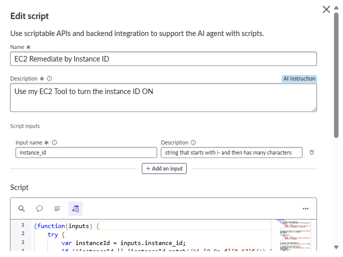
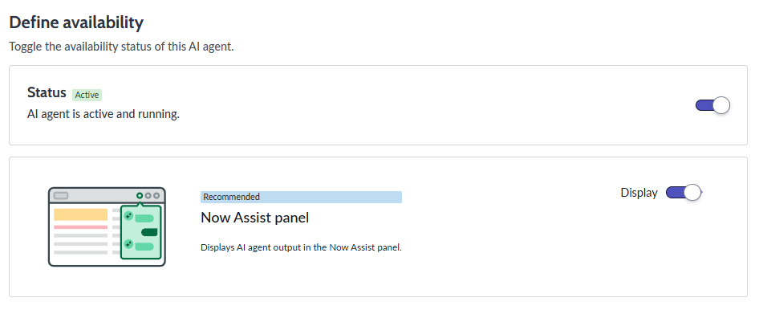
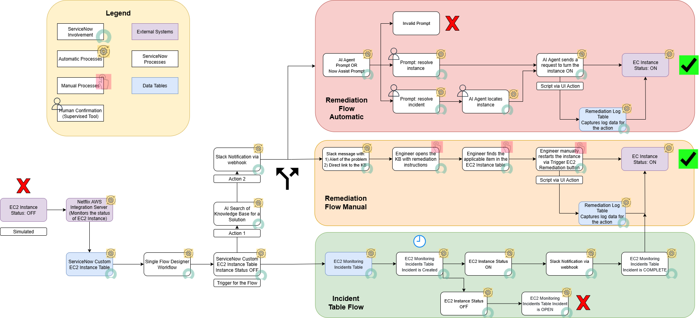
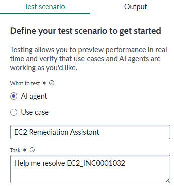
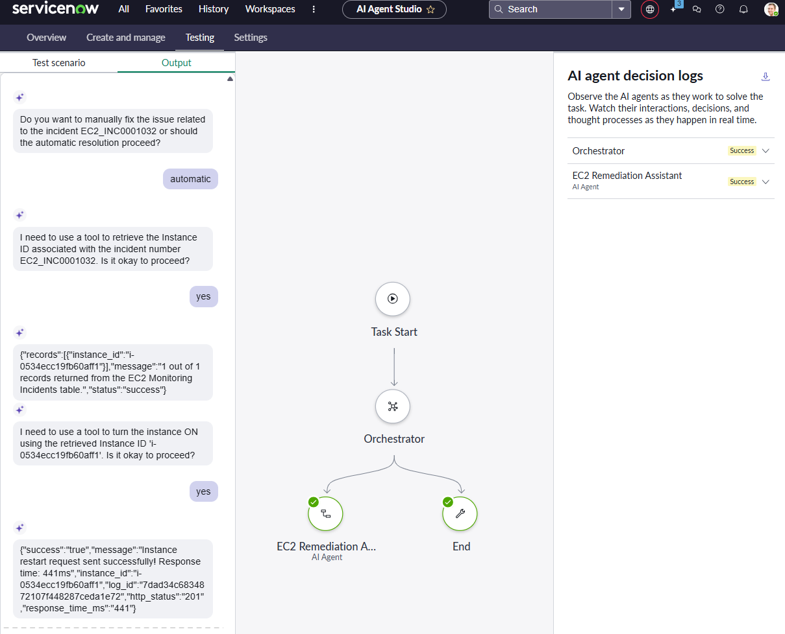

# EC2 AI-Enhanced Monitoring and Remediation System – ServiceNow Implementation

## System Overview
This project extends the **EC2 Monitoring and Remediation System** (ec2-remediation-system) in ServiceNow with a conversational **AI Agent**.  

Netflix’s DevOps team now has **two remediation paths**:

- **Manual:** Engineers navigate to an EC2 Instance record and use the **Trigger EC2 Remediation** UI Action.  
- **AI-Assisted:** Engineers chat with the **EC2 Remediation Assistant**, which:
  - Accepts either an **AWS `instance_id`** or an **Incident number**  
  - Retrieves the target EC2 record  
  - Explains the intended action and requests **explicit human approval**  
  - Calls the same **RemediationHelper logic** and **AWS Integration Server API** as the manual flow  
  - Logs every attempt to the **Remediation Log table** for auditability  
  - Provides default error handling if the input is malformed or the record cannot be found  

The AI Agent leverages **two tools** within ServiceNow Agent Studio:  
- **Record Operations** – to read incident records and identify associated `instance_id`s if an **Incident number** is provided.  
- **Script Tools** – to restart EC2 instances by calling the existing remediation logic if `instance_id`v is provided.  

📸 AI Agent Description.

📸 Tools. Record Operation and Script.

---

## Implementation Steps
Key steps to integrate the AI Agent into the existing manual remediation system:

1. **Custom Tables (unchanged)**  
   - `EC2 Instance` – instance metadata + status (ON/OFF).  
   - `Remediation Log` – every remediation attempt, payload, response.  
   - `EC2 Monitoring Incidents` – incidents created when status = OFF.  

2. **Manual UI Action (existing)**  
   - *Trigger EC2 Remediation* button on EC2 Instance records.  
   - Calls `EC2RemediationHelper` Script Include with `sys_id`.  

3. **AI Agent Creation**  
   - Agent: *EC2 Remediation Assistant*  
   - Instructions: parse natural language, extract `instance_id` or incident number, confirm steps with user, escalate errors if invalid  
   - Mode: **Supervised** for human approval  

4. **Agent Tools (new)**  
   - **Record Operations Tool** – lets the agent read incidents and map them to EC2 records.  
   - **Script Tool (EC2 Remediate by Instance ID)** – input: `instance_id`; logic: query EC2 Instance table, call **RemediationHelper** via Connection & Credential Alias, write Remediation Log.  
   - Handles: invalid IDs, duplicate matches, missing connection alias.  

5. **Agent Integration**  
   - Linked both tools to the AI Agent.  
   - Confirmed outputs are structured (booleans, http_status, log_id) for conversational display.  

📸 AI Agent Published.

---

## Architecture Diagram
Enhanced workflow diagram showing both manual and AI-driven paths:

📸 Architecture Diagram.

The enhanced architecture combines the existing manual remediation path with the new AI conversational interface.

**Overall Flow:**  
AWS EC2 → AWS Integration Server → ServiceNow Custom Table → Flow Designer Workflow →  
AI Agent Conversational Interface + Manual UI Action → AWS Integration Server API

- **Manual Path**  
  Engineer → EC2 Record → UI Action → Script Include → AWS API → Remediation Log → Flow resolves incident → Slack update  

**AI Path (detailed):**  
Engineer → Chat with Agent → Parse input (`instance_id` or `incident`) → Confirm action →  
- **Record Operations** (find `instance_id` from incident)  
- **Script Tool** (restart instance, log)  
→ Script Include → AWS Integration Server API → Remediation Log → Flow resolves incident → Slack update

---

## Optimization
**Manual vs AI Agent comparison**

- **Manual** 
- You look up the record by **`sys_id`**
- Fast if you already have the record open
- You must click around and know the exact Instance you want to bring up 

- **AI Agent** 
- You just give it an **`instance_id`** or **incident number** that you get from the Slack message
- Works in AI Agent chat or Now Assist, no need to open forms
- Always asks before running a fix to confirm execution
- Handles bad IDs by directing the user to double-check 
- Uses two tools:
  - **Record Operations** → finds the record from the Incident table
  - **Script Tool** → runs the remediation (e.g., restarts the Instance, logs it)

📸 AI Agent Scenario.

---

## DevOps Usage
**Two options for Netflix engineers**

1. **Manual Remediation**  
   - Open EC2 Instance record  
   - Click **Trigger EC2 Remediation**  
   - Watch Remediation Log for results; Flow resolves related incident and posts Slack notification  

2. **AI Conversational Remediation**  
   - In AI Agent Studio or chat window:  
     - Example A: `Restart instance i-...`  
     - Example B: `Help me with incident EC2_INC...`  
   - Agent confirms: *“I found instance i-… linked to that record. Do you want me to restart it now?”*  
   - Engineer approves  
   - Agent executes remediation, logs attempt, and provides output details (log_id, http_status)  
   - Flow and Slack notifications update as with manual remediation  

📸 AI Agent Flow.

